# Manual de utilizare - Administrator / Operator

Acest manual este destinat utilizatorilor cu rol **Administrator** sau **Operator**
ai unei organizații din Lot cu Lot (firma producătoare/reciclatoare - clientul
platitor al platformei). Rolul **Operator** are acces la operațiunile zilnice
(stoc, producție, comenzi, clienți, livrări). Rolul **Administrator** are, în plus,
configurarea produselor/rețetelor, personalizarea organizației (white-label) și
managementul utilizatorilor - detaliate în [`ghid-administrare.md`](ghid-administrare.md).

Interfața este aceeași pentru ambele roluri (un singur meniu, în stânga ecranului),
cu excepția "Setări", vizibilă doar pentru Administrator.

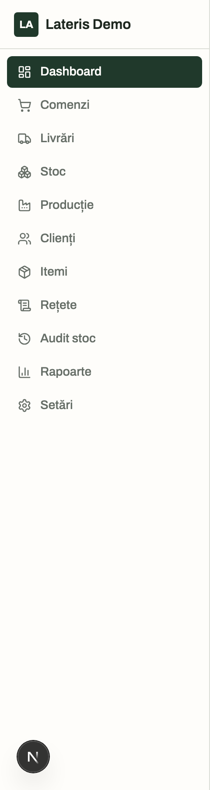

---

## 1. Autentificare

Adresa de acces este cea a organizației (subdomeniu sau domeniu propriu, configurat
de administratorul platformei - vezi `ghid-administrare.md`). Nu există înscriere
publică: contul se creează **doar prin invitație** trimisă de administratorul
organizației (secțiunea "Setări -> Utilizatori").

1. Deschide pagina **"Autentificare"** (`/login`). Sigla și numele organizației apar
   automat, pe baza domeniului de acces (white-label).
2. La prima logare, dai click pe linkul din emailul de invitație - ajungi pe ecranul
   **"Setează parola"**, unde completezi câmpurile **"Parola nouă"** și
   **"Confirmă parola"** (minim 8 caractere), apoi apeși **"Salvează parola"**.
3. La logările următoare, completezi **Email** și **Parolă** și apeși **"Conectare"**.
   Există și alternative: **"Continuă cu Google"** și trimiterea unui link de
   autentificare pe email (câmpul "Sau primește un link pe email" + butonul "Trimite").
4. Dacă ai uitat parola, apasă **"Ai uitat parola?"** de lângă câmpul Parolă ->
   ecranul **"Resetare parolă"** -> introduci emailul -> **"Trimite link-ul"** -> primești
   un email cu link către ecranul de setare a parolei noi.

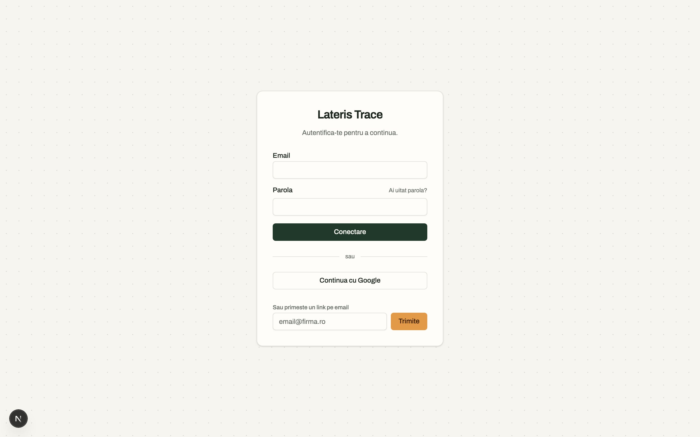

---

## 2. Panou de control

Ecranul **"Panou de control"** (prima pagină după logare) oferă o privire de ansamblu:

- **Comenzi active** - comenzi trimise, acceptate sau livrate (neînchise, neanulate).
- **De acceptat** - comenzi trimise, în așteptarea acceptării.
- **Livrate luna aceasta** - comenzi livrate în luna curentă.
- **Certificate emise** - total, de la începutul activității.

Sub cele patru cifre, cardul **"Rapoarte operaționale"** face trimitere directă la
pagina "Rapoarte" (link **"Vezi rapoarte"**).

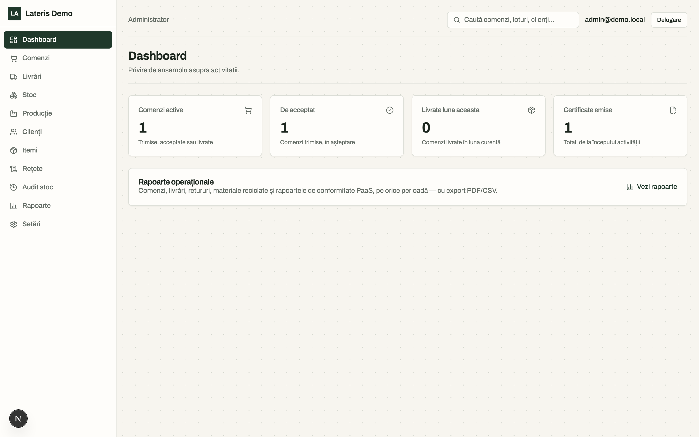

---

## 3. Clienți

Meniul **"Clienți"** afișează firmele cu care organizația lucrează (cumpărători și,
opțional, furnizori de materiale/deșeuri). **Regulă de business: un client = o
singură firmă juridică, cu un singur utilizator de portal** (nu persoane fizice).

### 3.1 Lista clienților

Ecranul **"Clienți"** listează firmele existente, cu o casetă **"Căutare"**
(după denumire sau CUI) și butonul **"Filtrează"** / **"Resetează"**.

### 3.2 Adăugarea unui client nou

1. Din lista de clienți, apasă **"+ Adaugă client"** -> ecranul **"Adaugă client"**.
2. Completează câmpul **CUI** (fără prefixul "RO" - se normalizează automat) și
   apasă **"Caută"** lângă el: sistemul interoghează baza publică ANAF și, dacă
   găsește firma, precompletează automat **Denumire**, **Nr. Registrul Comerțului**,
   **Adresă sediu** și bifa **"Plătitor de TVA"**. Datele rămân complet editabile -
   dacă lookup-ul eșuează sau firma nu e găsită, se completează manual.
3. Completează, opțional, secțiunea **"Contact"**: Email, Telefon, Persoană de
   contact, Note, și bifa **"Este și furnizor (materiale/deșeuri)"** dacă firma
   aduce și materiale la reciclare.
4. Apasă **"Creează clientul"**.

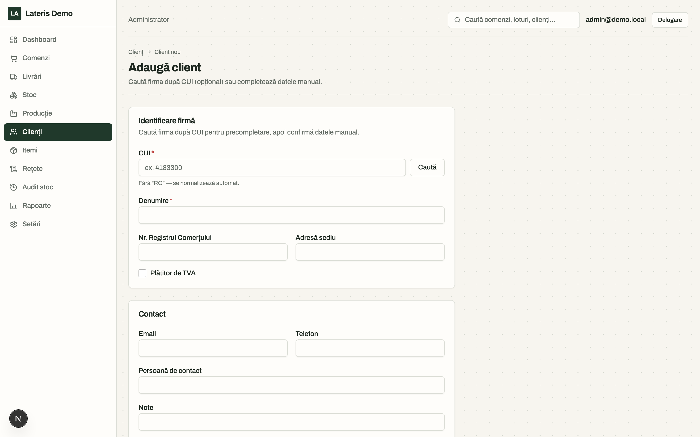

### 3.3 Detaliul unui client

Din listă, click pe o firmă deschide ecranul de detaliu, cu secțiunile:

- **"Date firmă"** - același formular ca la creare, editabil (buton
  **"Salvează modificările"**).
- **"Adrese de livrare"** - poate avea mai multe adrese; una poate fi marcată
  implicită.
- **"Documente"** - încărcare de fișiere atașate clientului (contracte semnate,
  certificate de la client etc.). **Contractele se arhivează aici** ca documente
  (etichetă sugerată "Contract") - platforma nu gestionează structurat perioade,
  obligații sau tarife contractuale, doar arhivează PDF-ul semnat.
  - Formular **"Încarcă document nou"**: alege **Fișier** (PDF, imagine sau Office,
    max. 10MB) și, opțional, o **Etichetă** (sugestii: "Contract", "Certificat",
    "Aviz"), apoi apasă **"Încarcă"**.
  - Fiecare document din listă are butoanele **"Descarcă"** și **"Șterge"**
    (cu confirmare).
- **"Istoric comenzi"** - placeholder informativ; istoricul detaliat de comenzi
  al clientului se consultă din ecranul **"Comenzi"** (filtrare după client) sau
  din **"Căutare"**.

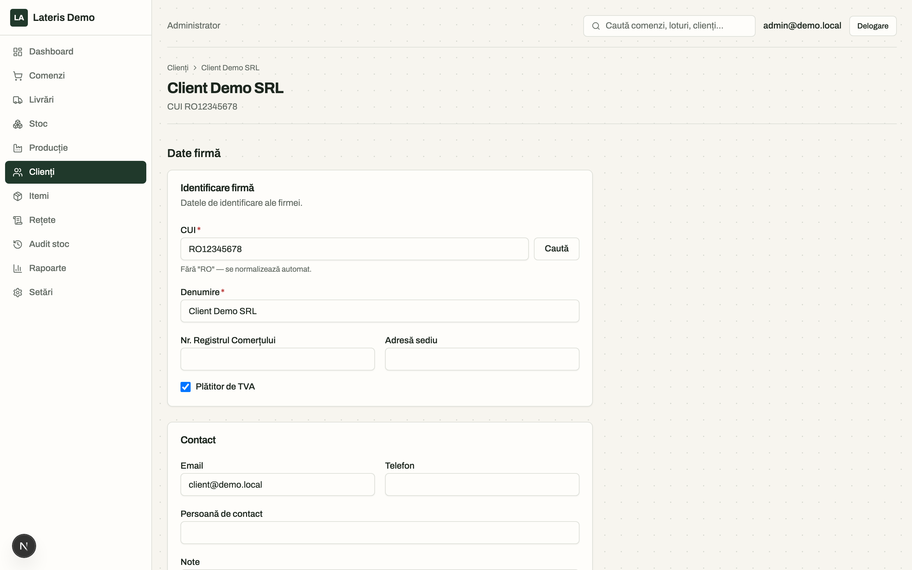

---

## 4. Materiale, Abonamente, Rețete

### 4.1 Materiale

Meniul **"Materiale"** este catalogul de materiale fizice al organizației -
**fără prețuri**. Fiecare material ține stoc (loturi) și poate avea o rețetă.

Abonamentele (produse-ca-serviciu, fără stoc) au ecran propriu - vezi
secțiunea 4.2.

Lista permite filtrare după **Căutare** (titlu) și **Vandabil** (Da/Nu).

Pentru a adăuga un material, apasă **"+ Adaugă material"** și completează:

- **Titlu** (obligatoriu)
- **Descriere**
- **Unitate de măsură** (kg, tonă, mc, litru, bucată, sac, palet) - **un singur UM
  per produs**; dacă același material se vinde în unități diferite, se creează
  produse separate (fără conversii între unități).
- **Urmărește stocul** - dezactivează doar pentru materiale generice fără cantitate
  limitată (ex: apă, aer).
- **URL poză** (opțional)
- Bifa **"Vandabil (apare în catalogul clientului)"** - doar materialele
  vandabile apar în catalogul portalului client.

Apasă **"Creează materialul"**.

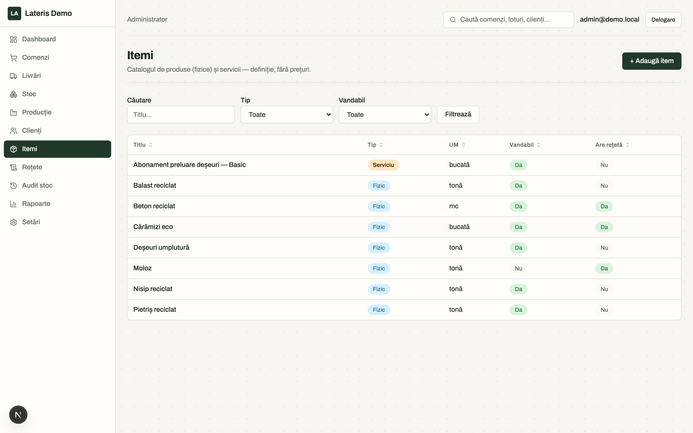

### 4.2 Abonamente

Meniul **"Abonamente"** este catalogul de produse-ca-serviciu (PaaS) al
organizației - **fără stoc și fără prețuri** (ex. mentenanță periodică,
închiriere de echipament). Ecranul oglindește "Materiale", dar fără rețetă și
fără opțiunea de urmărire a stocului (irelevantă pentru un abonament).

Pentru a adăuga un abonament, apasă **"+ Adaugă abonament"** și completează
**Titlu**, **Unitate de măsură**, opțional **Descriere** și **URL poză**, apoi
bifa **"Vandabil"** dacă abonamentul trebuie să apară în catalogul clientului.

Apasă **"Creează abonamentul"**.

### 4.3 Rețete

Meniul **"Rețete"** listează rețetele definite pentru materiale. O rețetă
descrie **compoziția în procente** a unui produs din materii prime. **Rețetele nu
se versionează** - dacă se schimbă compoziția, se creează un material (produs) nou.

Fiecare rețetă are o **metodă** explicită:

- **Producție** - produsul se obține din materiile prime de mai jos (ex. beton din
  apă + nisip + ciment).
- **Reciclare** - produsul se descompune în materialele rezultate de mai jos (ex.
  moloz în nisip + pietriș + balast).

Pentru a defini/edita rețeta unui material: din listă, click pe material -> ecranul
**"Rețetă - `<nume material>`"**. Dacă materialul nu are încă rețetă, apare un buton
de creare; altfel, editorul de rețetă permite adăugarea/editarea materiilor prime
(sau a materialelor rezultate, la metoda Reciclare) și a procentelor lor. Rețetele
se pot defini **doar pentru materiale** (nu și pentru abonamente - ecranul afișează
un mesaj informativ).

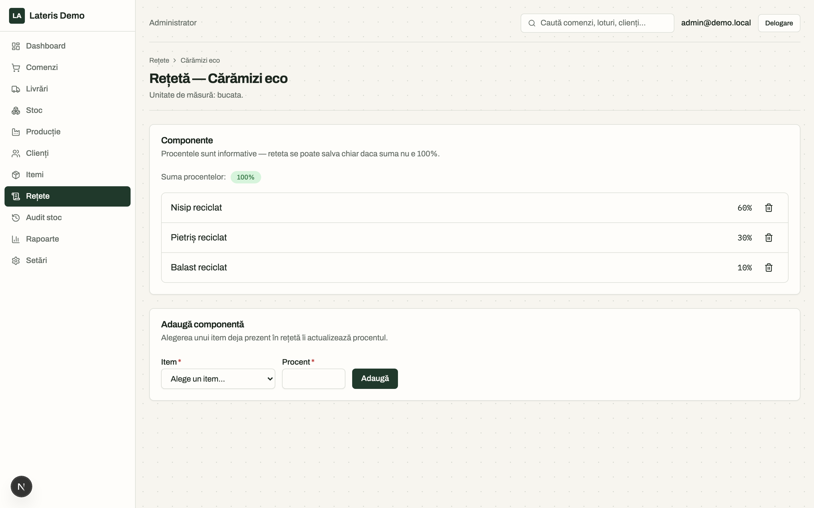

---

## 5. Stoc

Meniul **"Stoc"** afișează **loturile** aflate în stoc - fiecare intrare de
materie primă sau produs finit creează un lot propriu, cu proveniență și cantitate.

### 5.1 Lista de loturi

Coloane: Material, Data intrare, Proveniență, Cantitate rămasă/inițială, Calitate,
Status (Activ/Blocat), Acțiuni. Filtrare după **Material** și **Proveniență**.

Proveniențele posibile la intrare manuală: **Achiziție, Producție internă,
Reciclare, Recondiționare, Retur, Ajustare inventar**. (Recondiționarea este
distinctă de reciclare în trasabilitate și rapoarte - cerință de conformitate.)

### 5.2 Adăugarea unui lot nou

1. Apasă **"+ Adaugă lot"** -> ecranul **"Adaugă lot"**.
2. Alege **Material**, completează **Cantitate**, **Data intrare** (implicit azi),
   **Proveniență**, opțional **Sursă** (furnizor/proces/referință liberă) și
   **Locație** (depozit/zonă), opțional o **Notă**.
3. Apasă **"Înregistrează lotul"** - se creează automat și evenimentul de intrare
   în auditul de stoc.

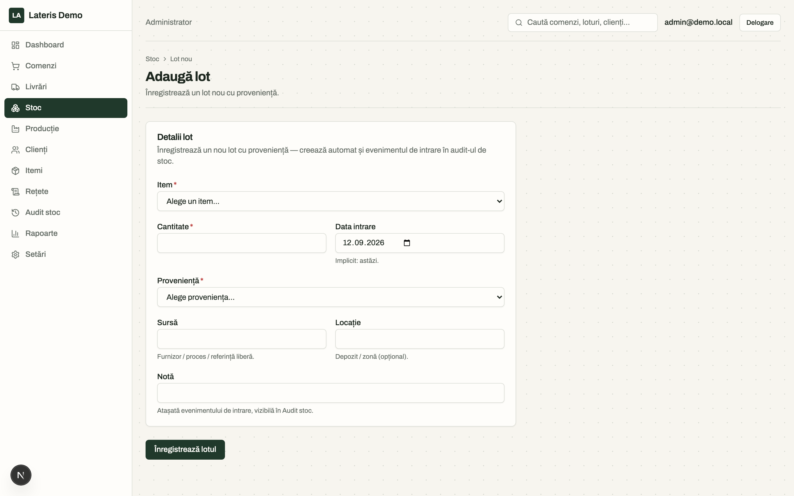

### 5.3 Blocarea/deblocarea unui lot

Din lista de loturi, coloana "Acțiuni":

- Pe un lot activ, apasă **"Blochează"** -> apare un câmp **"Motivul blocării"**
  (obligatoriu) -> **"Confirmă"** (sau **"Anulează"** pentru a renunța). Un lot
  blocat **iese din stocul disponibil** (nu mai poate fi consumat la producție).
- Pe un lot blocat, apasă **"Deblochează"** pentru a-l reintroduce în stocul
  disponibil.

### 5.4 Consumul de stoc

**Regulă de business:** consumul loturilor la producție se face implicit **în
ordinea intrării** (se consumă mai întâi loturile cele mai vechi), cu opțiune de
selecție manuală în ecranele de producție (secțiunea 6).

### 5.5 Audit stoc

Meniul **"Audit stoc"** este jurnalul complet al mișcărilor de stoc - Intrare,
Consum, Ajustare, Blocare, Deblocare, Stornare - cu filtrare pe **Material** și
**Tip eveniment**. Butonul **"⤓ Exportă CSV"** (în antetul paginii) descarcă
lista filtrată curentă ca fișier CSV.

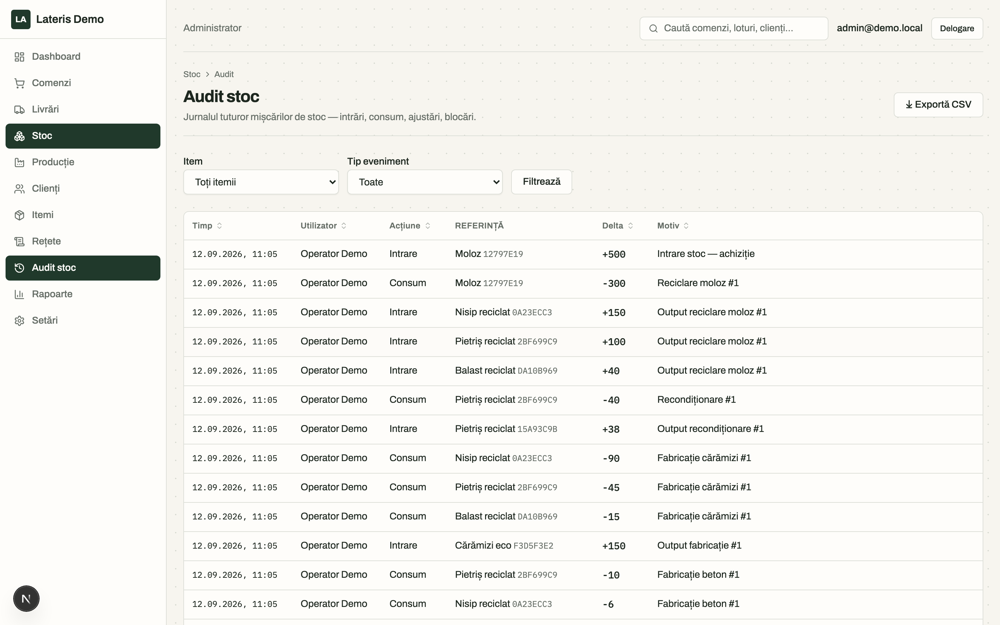

---

## 6. Producție și reciclare

Meniul **"Producție"** listează procesele de fabricație/reciclare/recondiționare
derulate, cu status: **Planificat -> În lucru -> Așteaptă confirmare -> Finalizat**
(sau **Anulat**).

### 6.1 Pornirea unui proces nou

Apasă **"+ Pornește proces"** -> ecranul **"Pornește proces"**, cu **două fluxuri**,
alese din tab-uri:

**a) "Fabricație"** (ex. fabricare cărămizi, pavaje):

1. Alegi rețeta/produsul și **cât vrei să produci**.
2. Sistemul calculează automat, pe baza rețetei (procente), **consumul necesar**
   din fiecare materie primă și propune alocarea din loturile disponibile, în
   ordinea intrării (previzualizare live, cu eventuale erori dacă nu e stoc
   suficient).
3. Diagrama **Sankey** afișează vizual fluxul: loturi consumate -> proces -> lot
   rezultat.
4. Apeși **"Confirmă și pornește ->"** - se creează procesul, se consumă loturile
   și se creează lotul/loturile noi rezultate.

**b) "Reciclare"** (ex. reciclare moloz, demolări):

1. Alegi materialul **de reciclat** și cantitatea introdusă.
2. Sistemul afișează **materialele rezultate ideale** conform rețetei (fracțiile
   teoretice).
3. Ajustezi manual cantitățile **reale** obținute pentru fiecare fracție (coloana
   editabilă), pentru că randamentul real diferă de cel teoretic.
4. Confirmi - se creează loturile noi rezultate, cu proveniența "Reciclare" (sau
   "Recondiționare", după caz).

**Notă:** pierderile/randamentul se **înregistrează**, nu se validează - sistemul
nu blochează un proces cu randament sub cel ideal.

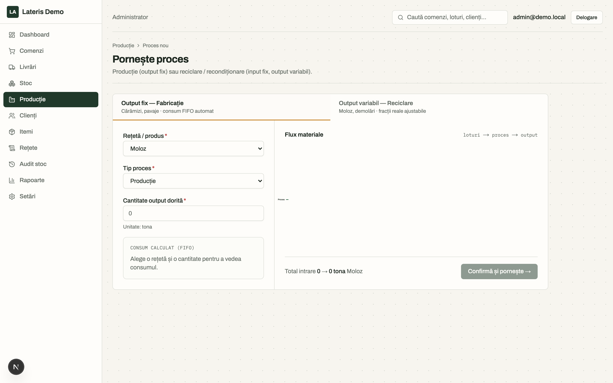

### 6.2 Detaliul unui proces

Click pe un proces din listă deschide ecranul de detaliu, cu:

- Diagrama **"Flux materiale"** (Sankey: consumat -> proces -> rezultat).
- Cardurile **"Materii prime (loturi consumate)"** și **"Materiale rezultate
  (loturi create)"**, cu total consumat/rezultat.
- **"Randament / pierderi"** - diferența dintre cantitatea consumată și cea
  rezultată, informativă.
- Buton **"Anulează procesul"**, disponibil doar cât procesul e într-un status
  netermin (Planificat/În lucru/Așteaptă confirmare).

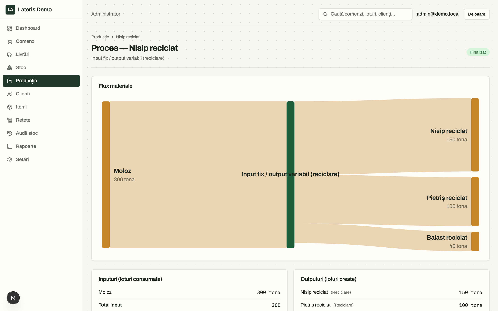

---

## 7. Comenzi

Meniul **"Comenzi"** listează comenzile clienților, cu filtrare după **Status**
și **Căutare** (client sau număr comandă).

### 7.1 Tipul comenzii (Material / Abonament / Aport)

Orice comandă are un **tip**, ales explicit la creare (nu există o valoare
implicită) - el dă sensul mișcării de stoc:

| Tip           | Sens               | Efect la acceptare                                   |
| ------------- | ------------------ | ---------------------------------------------------- |
| **Material**  | organizație → client | **scade** stocul (se folosesc întâi loturile cele mai vechi) |
| **Abonament** | organizație → client | ca la material, plus câmpul **"Retur estimat"**      |
| **Aport**     | **client → organizație** | **crește** stocul: materialul adus de client intră ca lot nou |

**Aportul** acoperă cazul în care clientul aduce material către organizație (ex.
moloz din demolări, pentru reciclare). La linii se pot alege **orice materiale**,
inclusiv cei nevandabili (materiile prime nu apar în catalogul de vânzare). O
comandă de aport nu se "trimite" și nu se "livrează": are o singură acțiune,
**"Acceptă aport"** (vezi 7.4), după care rămâne **Acceptată**.

### 7.2 Mașina de stări a unei comenzi

```
Ciornă -> Trimisă -> Acceptată -> Livrată -> Închisă
                      ↓
                   Anulată (posibilă din stările netermin)
```

Butoanele de tranziție rapidă apar contextual (doar tranzițiile valide din
statusul curent, atât în listă cât și în ecranul de detaliu):
**"Trimite"**, **"Acceptă"**, **"Livrează"**, **"Închide"**, **"Anulează"**.

- **"Acceptă"** este momentul-cheie de business: **la acceptare se scade stocul**
  (se folosesc întâi loturile cele mai vechi, pentru fiecare linie a comenzii). La
  **"Anulează"**, dacă stocul fusese deja scăzut, acesta **se reface**.
- **"Închide"** generează **automat** certificatul de trasabilitate PDF al
  comenzii - nu există un buton separat "Generează certificat".

### 7.3 Crearea unei comenzi în numele clientului

Organizația poate crea o comandă în numele unui client (flag intern
"creată de organizație"), util pentru fluxul dominant real (comenzi preluate prin
telefon/WhatsApp și înregistrate în platformă):

1. Din lista "Comenzi", apasă **"+ Comandă nouă"** -> ecranul **"Comandă nouă"**.
2. Alege **Tipul comenzii** (Material / Abonament / Aport - vezi 7.1). Abia după
   această alegere se poate completa lista de materiale/abonamente, pentru că ea
   depinde de tip.
3. Alege **Client**, opțional o **Adresă de livrare** (dependentă de client) și o
   **Dată livrare**, opțional **Note**. La tipul **Abonament** apare în plus
   **"Retur estimat"** (data la care se așteaptă bunul înapoi).
4. În secțiunea **"Linii comandă"**, alege un material sau abonament și o cantitate, apasă
   adaugă-linie; repetă pentru fiecare produs; poți șterge o linie adăugată.
5. Trimite formularul - comanda se creează ca **Ciornă**.

Notificările prin email se trimit identic indiferent dacă e comandă creată de
client sau de organizație.

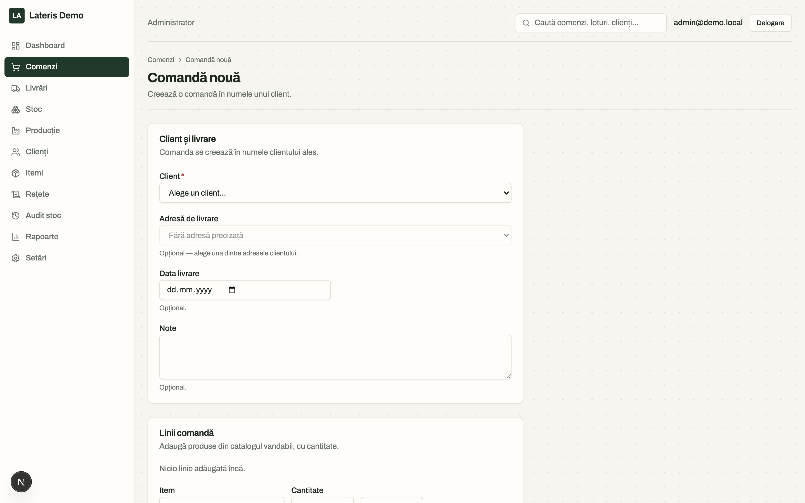

### 7.4 Detaliul unei comenzi

Ecranul de detaliu (`/comenzi/[id]`) afișează: **tipul comenzii** (cu o scurtă
explicație), client (CUI, notă "Creată de organizație în numele clientului" dacă e
cazul), livrare (adresă, dată livrare, eventual "Retur estimat (închiriere)" pentru
fluxul de abonament/închiriere), linii de comandă, și un **traseu vizual al
statusului** (Ciornă -> Trimisă -> Acceptată -> Livrată -> Închisă, sau "Anulată").

Dacă o comandă a fost livrată/închisă, pot apărea butoanele **"Retur"** și
**"Garanție"** (secțiunea 8). Dacă certificatul există deja, apare butonul
**"Vezi certificat"**.

Pe o comandă de tip **Aport** aflată în Ciornă, în locul butoanelor de tranziție apare
**"Acceptă aport"**: materialul adus de client intră în stoc ca lot nou, cu
proveniența "Aport client", cu **clientul care l-a adus** păstrat pe lot
(trasabilitate) și cu calitatea **"Neverificat"** - controlul de calitate se face
ulterior, din ecranul de Stoc. Traseul afișat se oprește la "Acceptată".

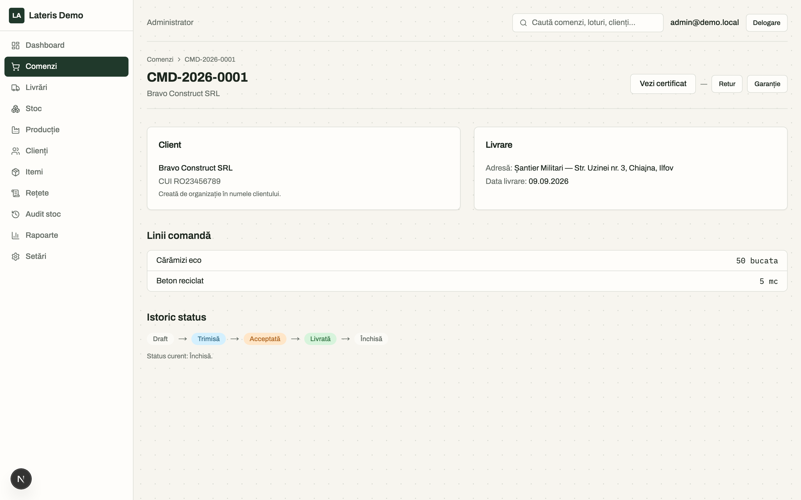

---

## 8. Retur și garanție

După ce o comandă e finalizată (livrată/închisă), din ecranul ei de detaliu pot
apărea două butoane - **care dintre ele apare depinde de tipul comenzii** (7.1):

| Tipul comenzii | "Retur" | "Garanție" |
| -------------- | ------- | ---------- |
| Material       | nu      | da         |
| Abonament      | da      | da         |
| Aport          | nu      | nu         |

Motivul: un **retur pur** (materialul se întoarce în stoc, fără înlocuire) are sens
pe o **închiriere** care se încheie, nu pe o vânzare de material, care e o
tranzacție într-un singur sens; **garanția** rămâne posibilă și pe material, pentru
că un produs defect trebuie înlocuit. Pe un **aport** nu se aplică niciunul -
materialul a venit de la client, nu către el.

- **"Retur"** - clientul (sau organizația, în numele lui) aduce materialele
  înapoi. Se deschide un formular cu o linie per produs livrat, cu maximul
  returnabil afișat (`Max. returnabil: <cantitate> <UM>`); se introduc
  cantitățile efectiv returnate, opțional o notă, apoi **"Trimite"** - se
  creează o **nouă comandă**, legată de comanda originală (etichetă "Retur").
- **"Garanție"** - la fel ca returul, dar sistemul creează automat, în plus, o
  comandă de **înlocuire** (comandă de vânzare obișnuită, care parcurge fluxul
  normal Ciornă -> Trimisă -> Acceptată -> Livrată -> Închisă).

Comanda-retur/garanție nou creată apare inițial ca **Ciornă**; pe ea, în loc de
butoanele generice de tranziție, apare butonul dedicat **"Acceptă retur"** -
acceptarea unui retur **adaugă** materialul înapoi în stoc (după inspecție/
acceptare manuală), spre deosebire de acceptarea unei comenzi de vânzare, care
scade stocul.

**Închiriere (product-as-a-service):** este simulată prin comandă + retur, cu
câmpul opțional **"Retur estimat"** pe comandă (dată la care se așteaptă
materialul înapoi).

> 📷 **[Captură de adăugat: formularul de Retur/Garanție cu cantitățile per produs]**

---

## 9. Livrări, planificare rute, aviz și e-Transport

Meniul **"Livrări"** listează toate livrările planificate, cu statusul declarației
e-Transport și dacă ruta a fost **calculată** sau introdusă **manual**.

### 9.1 Planificarea unei livrări

Dintr-o comandă **acceptată** (ecranul `/comenzi/[id]`), butonul **"Planifică
livrare"** deschide formularul:

1. Completează **data programată**, **transportatorul**, **numărul de
   înmatriculare** și **șoferul**.
2. La secțiunea **"Rută"**: alege un **punct de plecare** (o stație/depozit
   configurat în **Setări → Puncte de plecare**, secțiunea 9.2) - câmpul
   "Punct de plecare" (text) se precompletează automat cu adresa stației, iar
   "Punct de sosire" cu adresa de livrare a comenzii, dacă există.
3. Apasă **"Calculează rute"** - aplicația propune 1-2 variante de rută, cu
   distanța și durata estimată (cu trafic), și marchează automat cea mai rapidă
   ca **"Recomandată"**. Poți alege oricare altă variantă din listă înainte de a
   planifica livrarea.
4. Apasă **"Planifică livrarea"**. Dacă nu ai nevoie de calculul rutei, poți
   completa "Punct de plecare"/"Punct de sosire" direct ca text și trimite
   formularul fără să apeși "Calculează rute" - planificarea rămâne validă.

### 9.2 Puncte de plecare (Setări → Puncte de plecare)

Doar administratorul poate adăuga/edita/șterge punctele de plecare (stații de
betoane, depozite) folosite ca origine la calculul rutelor - un singur punct
poate fi marcat **implicit** (preselectat la planificarea unei livrări noi).

### 9.3 Ecranul de detaliu al unei livrări (`/livrari/[id]`)

- **"Rută (planificare optimizată)"** - distanța/durata estimată și, dacă a fost
  generată, harta rutei. Butonul **"Recalculează"** reface calculul (util dacă
  adresa de livrare s-a schimbat) și păstrează automat cea mai rapidă variantă.
- **"Confirmarea recepției"** - după ce clientul confirmă (verbal, telefonic sau
  pe avizul semnat) că a primit marfa, completează **numele persoanei care a
  recepționat** și, opțional, observații, apoi apasă **"Confirmă recepția"**.
  Data confirmării se salvează automat.
- **"Declarare RO e-Transport"** - avizul de însoțire a mărfii se declară în RO
  e-Transport (ANAF) prin serviciul terț **Socrate.io** (pentru transporturile
  care depășesc pragurile legale). Codul **UIT** rezultat se stochează pe
  livrare și apare pe avizul PDF printabil (buton **"Descarcă avizul (PDF)"**).

---

## 10. Rapoarte

Meniul **"Rapoarte"** oferă 6 rapoarte operaționale, calculate pe o **perioadă**
selectabilă (câmpurile **"De la"** / **"Până la"** + butonul **"Aplică perioada"**):

1. **"Comenzi pe perioadă"** - numărul de comenzi create în perioadă, grupate pe status.
2. **"Livrări"** - comenzile livrate sau închise în perioadă.
3. **"Retururi și garanții"** - legăturile de retur/garanție cerute în perioadă.
4. **"Materiale reciclate/recondiționate reintegrate"** - loturi cu proveniență
   reciclare, recondiționare sau retur, intrate în stoc în perioadă.
5. **"Utilizare PaaS (livrat - returnat)"** - cantitatea efectiv utilizată de
   fiecare client (livrat minus returnat acceptat), per produs - relevant pentru
   clienți cu model de tip "abonament" (produs-ca-serviciu).
6. **"% materii prime secundare"** - ponderea materiilor prime secundare
   (reciclate/recondiționate/retur) din inputul de producție, per produs.

Fiecare raport are propriile butoane de export: **"⤓ PDF"** (cu antet white-label
al organizației) și **"⤓ CSV"**.

Un card suplimentar, **"CO₂ economisit - în pregătire (v2)"**, este afișat doar
informativ - **nu este încă un raport funcțional** (necesită factori de emisie
configurabili per organizație, planificat ulterior).

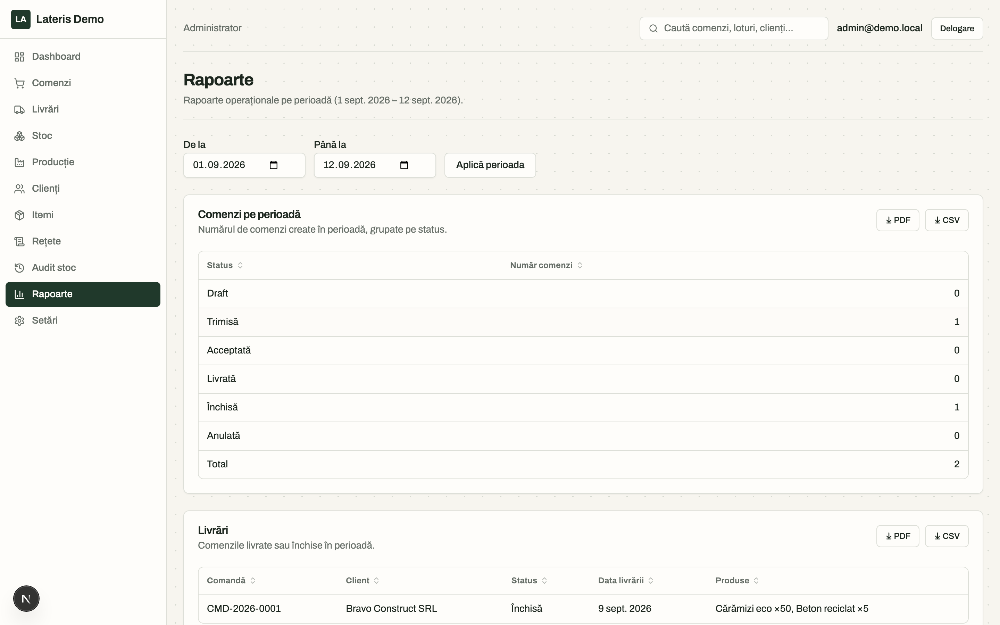

---

## 11. Căutare

Bara de căutare din partea de sus a ecranului (disponibilă doar pentru
Administrator/Operator) caută global în: **comenzi, clienți, loturi, produse și
certificate**. Se introduce un termen și se apasă Enter (sau se navighează direct
la pagina **"Căutare"**), rezultatele apar grupate pe tip.

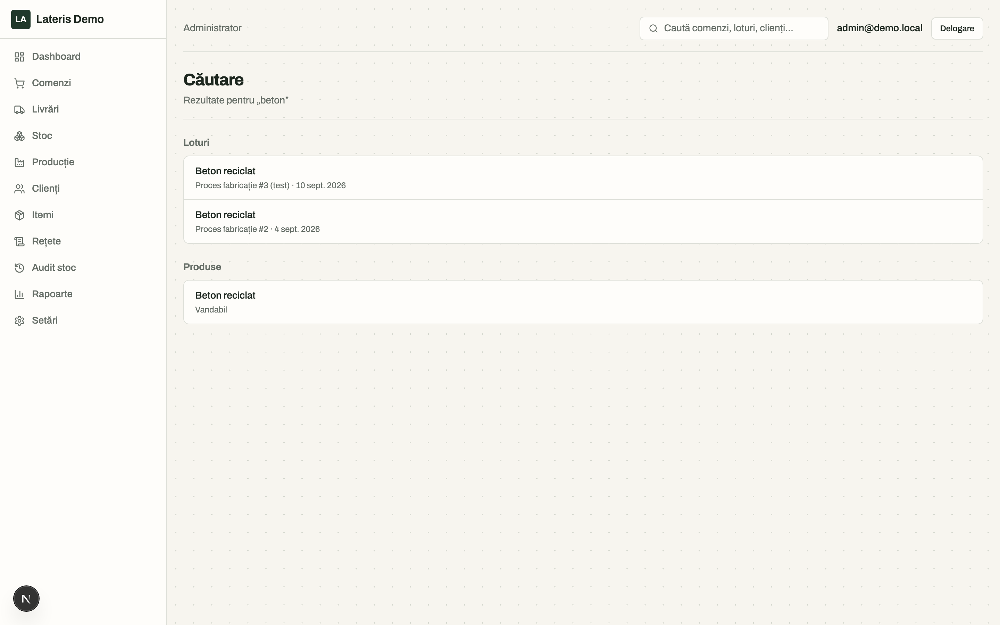

---

## 12. Setări (doar Administrator)

Configurarea organizației (identitate, white-label, domeniu, email) și
managementul utilizatorilor sunt descrise în detaliu în
[`ghid-administrare.md`](ghid-administrare.md) - accesibile din meniul
**"Setări"**, vizibil doar rolului Administrator.

---

## 13. Asistent AI

Meniul **"Asistent AI"** răspunde la întrebări despre aplicație și poate **propune**
acțiuni - creează un client nou, creează o comandă (inclusiv de tip **aport**, cu
materialele aduse de client), trimite o comandă spre acceptare, **planifică o
livrare**. Orice acțiune se arată întâi într-un **card de confirmare**, neexecutată:

- Câmpurile se afișează cu **denumiri**, nu cu identificatori interni (ex. la
  trimiterea unei comenzi vezi numărul și clientul ei, nu un cod tehnic).
- La o comandă propusă, cardul arată **același editor** ca ecranul "Comandă nouă"
  (secțiunea 7.3): poți schimba clientul, tipul comenzii, adresa de livrare, adăuga/șterge linii,
  înainte de a confirma.
- Apasă **"Confirmă și execută"** ca acțiunea să se producă efectiv, sau
  **"Renunță"** ca să o anulezi fără niciun efect.
- Dacă un câmp completat e invalid, asistentul explică ce trebuie corectat -
  cardul rămâne deschis, poți încerca din nou fără să reformulezi cererea.
- După o confirmare reușită, asistentul poate continua singur spre pasul următor
  al cererii inițiale (ex. "adaugă clientul X și o comandă cu Y" - după ce
  confirmi clientul, propune imediat comanda).
- La **planificarea unei livrări** (secțiunea 9), asistentul cere data,
  transportatorul, nr. de înmatriculare și șoferul; punctul de plecare (stația
  implicită a organizației) și cel de sosire (adresa de livrare a comenzii) se
  completează singure și rămân editabile în card. Dacă pleci dintr-o stație
  configurată, **ruta recomandată se calculează automat** și se salvează pe livrare
  (o poți recalcula sau schimba oricând din ecranul livrării). Ca și în aplicație,
  se pot planifica doar comenzile **acceptate** care nu au deja o livrare.
